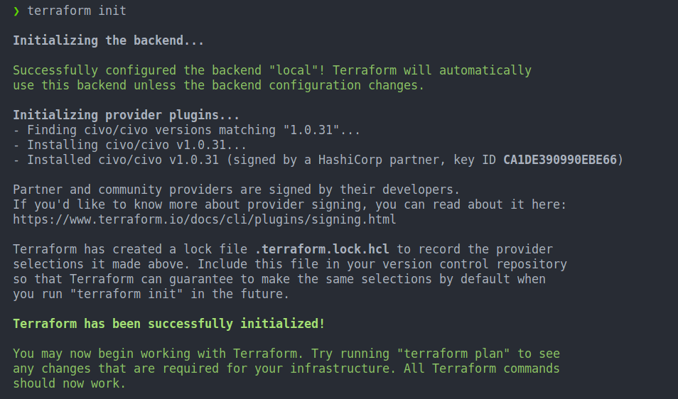
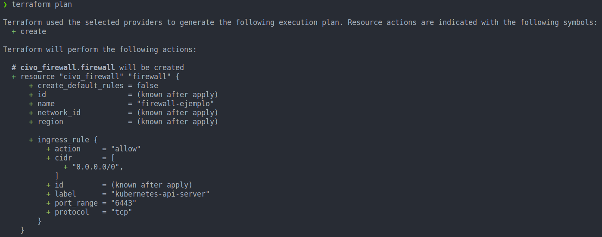
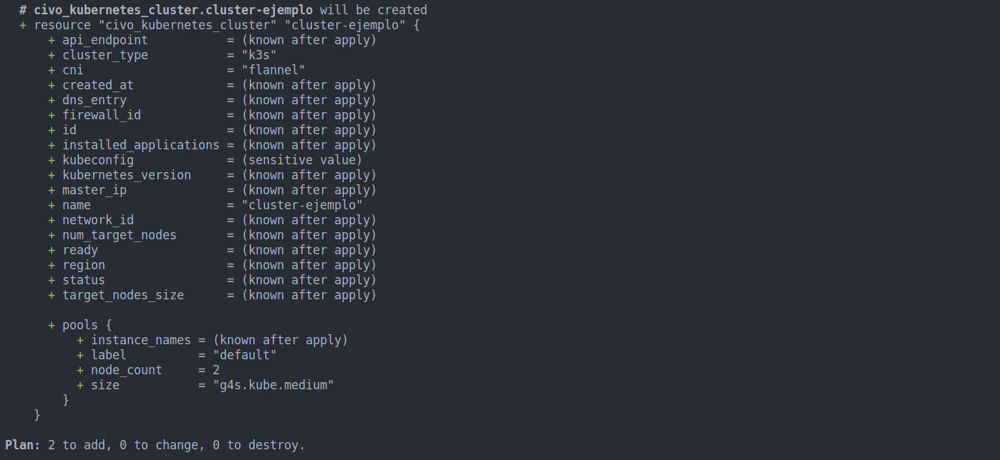
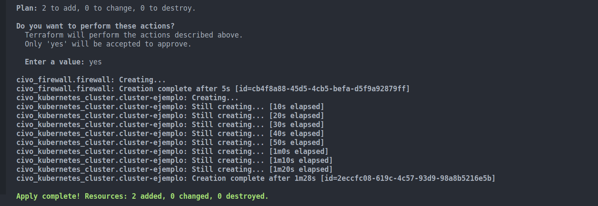
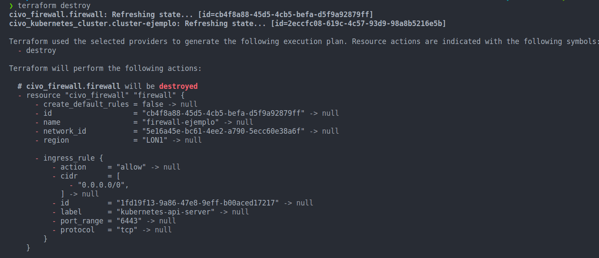
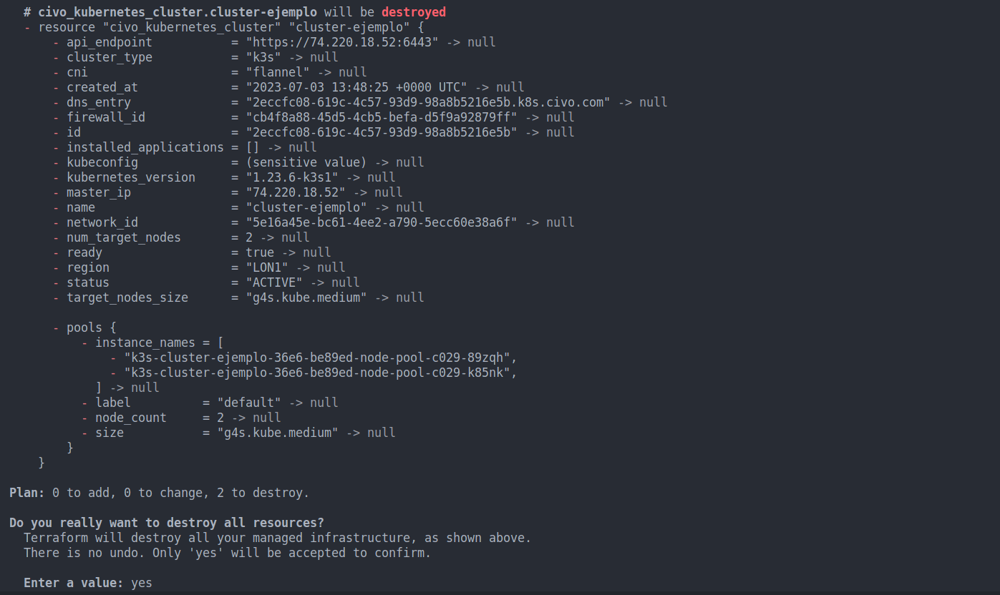

# Tutoriales

## Creación de un cluster de Kubernetes con CIVO y Terraform

### Requisitos

- Tener una cuenta en CIVO
- Tener instalado Terraform

### Creación del cluster

El provider de terraform de civo es muy sencillo de utilizar, simplemente hay que añadir el siguiente código en unos ficheros:

- main.tf:

```terraform
# Create a firewall
resource "civo_firewall" "firewall" {
  name                 = local.firewall.name
  create_default_rules = false
  ingress_rule {
    label      = "kubernetes-api-server"
    protocol   = "tcp"
    port_range = "6443"
    cidr       = ["0.0.0.0/0"]
    action     = "allow"
  }
}

# Create a cluster with k3s
resource "civo_kubernetes_cluster" "cluster-ejemplo" {
  name         = "cluster-ejemplo"
  firewall_id  = civo_firewall.firewall.id
  cluster_type = "k3s"
  cni          = "flannel"
  pools {
    label      = "default"
    size       = "g4s.kube.medium"
    node_count = 2
  }
}
```

- variables.tf:

```terraform
variable "civo_token" {
  type        = string
  default     = ""
  description = "description"
}
```

- providers.tf

```terraform
provider "civo" {
  token  = var.civo_token
  region = "LON1"
}
```

- backend.tf

```terraform
  terraform {
    backend "local" {
      path = "terraform.tfstate"
    }
    required_providers {
      civo = {
        source = "civo/civo"
        version = "1.0.31"
      }
    }
  }
```

### Ejecución

Para ejecutar el código, simplemente hay que ejecutar los siguientes comandos:

- Para inicializar el proyecto y descargar los providers:

```bash
terraform init
```

** Output: **


- Para ver los cambios que se van a realizar:

```bash
terraform plan
```

** Output: **



- Para aplicar los cambios:

```bash
terraform apply
```

** Output: **


- Para destruir el cluster:

```bash
terraform destroy
```

** Output: **



### Conclusiones


Civo es una plataforma muy sencilla de usar y con un precio muy contenido, para pymes es una gran opción a valorar. Para ver más información sobre Civo, visitar su [web](https://www.civo.com/) y sus precios [aquí](https://www.civo.com/pricing).
